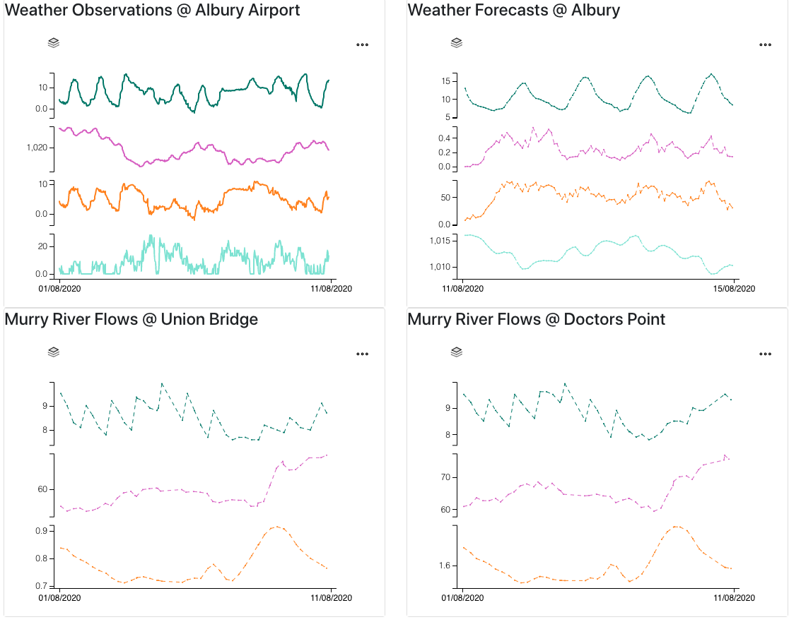

# Glaze Tutorial: Sample Dashboard

[](https://app.netlify.com/sites/hopeful-swirles-ad2660/deploys)

[View Dashboard](https://hopeful-swirles-ad2660.netlify.app/)

In this tutorial, we're going to build a data driven dashboard, from scratch, using [Amphora Glaze](https://www.amphoradata.com/glaze/).

> This tutorial requires a subscription to Amphora `Glaze`.

> If you aren't registered, head to [the app](https://app.amphoradata.com/).

My mum is an avid gardener in Albury. That part of Australia is prone to extreme temperatures: in the summer above 40, and in the winter, overnight frosts. Responding to these weather events in a timely manner is super important to keep your garden thriving. So what I'm going to do is build a dashboard for her to help detect and respond to these events.

Firstly, we're going to build some charts to display weather data (both real-time and forecasts). Then we're going to setup a periodic job to automatically detect weather extremes, and display alerts in the dashboard.

## Clone this Repository

To begin, clone this repo, and open this directory:

```sh
git clone https://github.com/amphoradata/samples.git
cd samples/glaze_dashboard
```

## Create an Amphora Application

Amphora Applications allow you to connect external apps to Amphora Data services. It enables OAuth logins to your app with the Amphora Identity system, and it allows the Amphora backend to response (via CORS) to requests from the app.

### Creating the application

We are going to need the Amphora Data python SDK installed.

#### Install the Python SDK

In a terminal:

```sh
cd python
pip install amphoradata # or use pip install -r requirements.txt
```

#### Run the create-application.py script

[This helpful script](python/scripts/create-application.py) enables you to create a new Amphora application.

```sh
> python create-application.py

Enter your Amphora username:rian@amphoradata.com
Password:
https://app.amphoradata.com
Enter a name for your app (default: my_app):sample_glaze_dashboard
Enter a logout callback URL (default: http://localhost:3000/logout):
Enter the deployed URL for your app (default: http://localhost:3000):
Enter an allowed redirect path (default: /#/callback):
You are about to register an app named sample_glaze_dashboard. Press any key to continue, or ctrl+c to cancel...
Your Application ID is f48fed4f-569e-4524-8432-b5ae4444eca4   # <-- copy this id
```

## Creating a react app

For this dashboard, we're going to use [react-amphora](https://github.com/xtellurian/react-amphora), a frontend react library that removes a lot of boilerplate code.

> You can see the final version of the app under the `/app` directory.

### Create an app with create-react-app

We're going to make a new typescript-based react app.

```sh
yarn create react-app app --template typescript
```

Running the above should create a new (mostly empty) react app in the `/app` directory. I've already done this here, so if you're trying this from scratch, you should start in an empty directory.

### Install react-amphora

`react-amphora` is an open source front-end react component library for building Amphora data driven apps. Install it like so:

```sh
cd app
yarn add react-amphora
```

#### Create a user manager

Amphora used OIDC and OAuth to authenticate users in client applications. We need to setup our user manager (from [oidc-client-js](https://github.com/IdentityModel/oidc-client-js)). Once done, it allows _any_ Amphora user to sign into our app!

[amphora/userManager.ts](app/src/amphora/userManager.ts)

```ts
import { createUserManager } from "react-amphora";

let redirectUri = `${window.location.href}#/callback`; // this matched the callback path we defined above.
const userManager = createUserManager({
  clientId: "f48fed4f-569e-4524-8432-b5ae4444eca4", // replace this with your application ID
  redirectUri,
});

export { userManager };
```

#### Create an Amphora Configuration

This enables some customisation of the Amphora API client, but we're just going to use defaults.

[amphora/configuration.ts](app/src/amphora/configuration.ts)

```ts
import { Configuration } from "amphoradata";
export const initalConfiguration = new Configuration();
```

### Setup the react-amphora provider

To use `react-amphora`, you wrap a react component in an `<AmphoraProvider>` component, like so:

[index.tsx](app/src/index.tsx)

```tsx
import { AmphoraProvider } from "react-amphora";
import { userManager } from "./amphora/userManager";
import { initalConfiguration } from "./amphora/configuration";

ReactDOM.render(
  <React.StrictMode>
    <AmphoraProvider
      userManager={userManager}
      configuration={initalConfiguration}
    >
      <App />
    </AmphoraProvider>
  </React.StrictMode>,
  document.getElementById("root")
);
```

Now, if you run the app (with `yarn start`), and navigate in your browser to [localhost:3000](http://localhost:3000), you'll should see the normal `create-react-app` bootstrap screen.

Now, we're going to add the sign in callback page, a sign in button, and a user information page.

### Add react-router and a authentication callback route

#### Install react-router

```
yarn add react-router-dom
yarn add -D @types/react-router-dom
```

#### Setup the router and auth callback

Wrap your application component in the BrowserRouter component, then handle a callback to your callback path (in this case `#/callback`), and pass the cleaned up parameters into the <CallbackPage />. This component handles the last part of the authentication for you.

[App.tsx](app/src/App.tsx)

```tsx
import {
  BrowserRouter as Router,
  RouteComponentProps,
  withRouter,
} from "react-router-dom";
import { userManager } from "./amphora/userManager";
import { CallbackPage } from "react-amphora";

const AppWithCallbackPage: React.FunctionComponent<RouteComponentProps> = (
  props
) => {
  if (props.location.hash.substring(0, 10) === "#/callback") {
    const signInParams = props.location.hash.substring(10);
    return (
      <CallbackPage
        onSignIn={() => props.history.push("/")}
        {...props}
        userManager={userManager}
        signInParams={`${signInParams}`}
      />
    );
  }
  return <App />;
};

var ConnectedApp = withRouter(AppWithCallbackPage);

const RoutedApp: React.FunctionComponent = () => {
  return (
    <Router>
      <ConnectedApp />
    </Router>
  );
};

export default RoutedApp;
```

#### Add a Sign In button component

The sign in button is a simple component that prompts the user to sign-in with Amphora.

```tsx
import { SignInButton } from "react-amphora";
...

<SignInButton alwaysOn={true} />
```

The Sign In Button, by default, will not render in the DOM if the user is already authenticated. You can override this behaviour using the `alwaysOn` prop.

#### Add a user information panel component

The user information component displays some information about the user, derived from the OIDC identity.

```tsx
import { UserInformationComponent } from "react-amphora";

<UserInformationComponent />;
```

### You did it!

Your app is now connected to Amphora!


## Deploying your app

There are many ways to deploy a React app, and some of them are listed in the [create react app docs](https://create-react-app.dev/docs/deployment/).

For this example, were going to deploy using [Netlify](https://www.netlify.com/).

### Deploy on Netlify

Follow [these instructions](https://create-react-app.dev/docs/deployment/#netlify) to deploy your app to Netlify.

### Register the new location on Amphora Data

Amphora needs to know where your app is deployed. To add the new location, use the [add-app-location.py](python/scripts/add-app-location.py) script.

```sh
> python add-app-location.py

Enter your Amphora username:rian@amphoradata.com
Password:
https://app.amphoradata.com
Enter your Amphora application Id:f48fed4f-569e-4524-8432-b5ae4444eca4 # <-- use your application id.
Enter your deployed host/ CORS origin:https://hopeful-swirles-ad2660.netlify.app # <-- use the host from your deployed app.
Enter the redirect path (default: /#/callback):
Found existing application: sample_glaze_dashboard
updated application
```

## Creating a dashboard

Now you've connected your app to Amphora, and deployed to the web, it's time to create a dashboard.

We're going to create a simple dashboard for viewing the weather feeds in Albury.

### Create a dashboard page.

To create a dashboard, we're going to use the `<ChartComponent />` from `react-amphora`.

The chart component extends Microsoft's [TSI client library](https://github.com/microsoft/tsiclient), and charts the data from Amphora Signals.

> NOTE: I used [moment.js](https://momentjs.com/) to work with dates.

[Dashboard.tsx](app/src/dashboard/Dashboard.tsx)

```tsx
import moment from "moment";
import { SignalsChart } from "react-amphora";

const range: ChartRange = {
  from: moment().startOf("month").toDate(),
  to: moment().toDate(),
};

...
<SignalsChart
  noAnimate={true}
  range={range}
  legend="hidden"
  amphoraId="ID of your Amphora"
//   signals={[]} // an optional list of signals to include. useful if you don't want all the data, or you are hitting rate limits.
/>;
```

### Routing to the dashboard

We used a [ProtectedRoute](app/src/ProtectedRoute.tsx) to ensure you can only see the dashboard when signed in. However, the SignalsChart component wouldn't render properly if the user was not signed in.

To put the dashboard under the path `/dashboard`, put a `<ProtectedRoute />` inside the `<Router />`

[App.tsx](app/src/App.tsx)

```tsx
<Switch>
  <Route exact path="/" component={Home} />
  <ProtectedRoute path="/dashboard" component={Dashboard} />
</Switch>
```

### Ensuring users have access

Using Amphora means differential data access. By default, other users won't have access to the data behind the dashboard, but in this case they can get access by [purchasing](https://www.amphoradata.com/docs/get_data/buy-data) the Amphora.

Using `react-amphora`, we can wrap any component in an EnsurePurchased component. This will check the user has access, and if not, will render a button to purchase it.

[Dashboard.tsx][app/src/dashboard/dashboard.tsx]

```tsx
import { SignalsChart, EnsurePurchased } from "react-amphora";

<EnsurePurchased amphoraId="an-amphora-id">
  <SignalsChart amphoraId="an-amphora-id" />
</EnsurePurchased>
```

## The dashboard

Here it is, my custom dashboard in all it's glory!



[View the Netlify version here](https://hopeful-swirles-ad2660.netlify.app/)

## Learn More

If you want to learn more about the Amphora Data platform or Glaze, head to [amphoradata.com](https://www.amphoradata.com)
